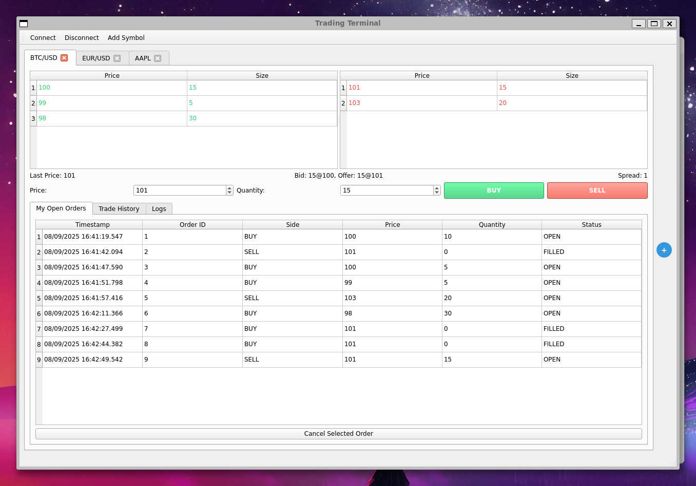
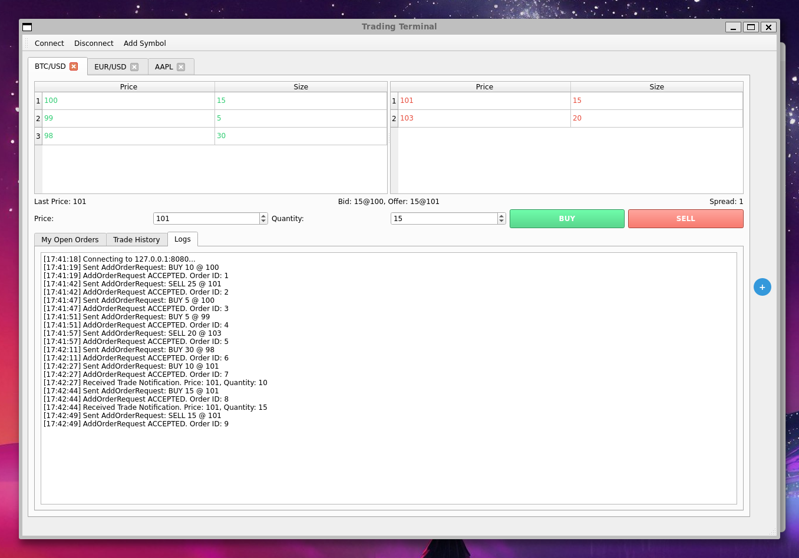

# Matching Engine

A C++17 implementation of a matching engine with order book, TCP networking,
and protocol serialization.
This project builds a reusable library and provides both a
server (`matching_engine`) and a client (`matching_engine_client`) executable.

## TODO

- Trades should be sent to all relevant connections
  - change ConnectionID to a string like username and store with the order?

---

## Features

- **Core library (`matching_engine_core`)**
  - Protocol serialization/deserialization
  - TCP client/server components
- **Server library (`matching_engine_lib`)**
  - Builds on top of `matching_engine_core`
  - Implements the engine and order book logic
- **Executables**
  - `matching_engine_server` — main server binary
  - `matching_engine_client` — cli client binary
  - `matching_engine_gui` - Qt client binary
- **Testing**
  - Unit tests using [GoogleTest](https://github.com/google/googletest)
- **Dependencies**
  - [Boost](https://www.boost.org/) (components: `log`, `log_setup`, `system`, `thread`)
  - [Qt6](https://doc.qt.io/qt-6/widgets.html) Widgets (for GUI client)

---

## Requirements

- CMake **3.25+**
- C++17 compiler (GCC, Clang, or MSVC)
- Boost (with required components)
- Qt6 (for GUI client)

---

## Project Layout

```text
core/                # Core library (protocol, TCP, ring buffer)
core/include/        # Public headers for core
core/lib/            # Core source files
core/tests/          # Unit tests for core

server/              # Server library and executable
server/include/      # Server headers (engine, orderbook)
server/src/          # Server sources
server/tests/        # Unit tests for server

client/              # CLI client
client/include/      # Client headers
client/src/          # CLI client sources

gui/                 # Qt GUI client
gui/src/             # GUI sources (mainwindow, main)
gui/src/mainwindow.ui # Qt Designer UI file

CMakeLists.txt       # Top-level CMake configuration
```

---

## Build Instructions

### 1. Configure the project

Always use an out-of-source build:

```bash
cmake -S . -B build -DCMAKE_EXPORT_COMPILE_COMMANDS=ON
```

#### Optional configuration

- Build type (default: Release):

 ```bash
cmake -DCMAKE_BUILD_TYPE=Debug ..
```

- Ring buffer capacity (default: 4096):

```bash
cmake -DRINGBUFFER_CAPACITY=8192 ..
```

- Max payload size (default: 256):

```bash
cmake -DMAX_PAYLOAD_SIZE=512 ..
```

### 2. Build

```bash
cmake --build build
```

Binaries will be placed under:

```text
build/bin/
```

Libraries will be placed under:

```text
build/lib/
```

### 3. Installation

To install the server, client, and headers:

```bash
cmake --install build
```

This will install:

- bin/matching_engine_server
- bin/matching_engine_client
- bin/matching_engine_gui
- include/matching_engine/*.h

You can adjust the install prefix:

```bash
cmake --install build --prefix /usr/local
```

## Running tests

Run tests with:

```bash
ctest
```

or directly:

```bash
./bin/matching_engine_core_tests
./bin/matching_engine_server_tests
```

## Cleaning the Build

- Remove build artifacts only:

```bash
cmake --build . --target clean
```

- Full clean (recommended):

```bash
rm -rf build/
```

## GUI Preview





